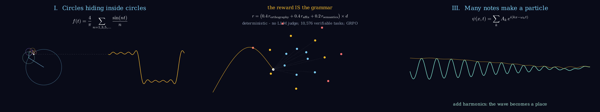
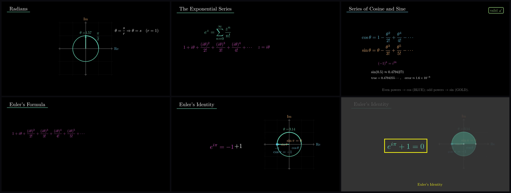

# Kimi3Manim



Math and physics animations imagined end-to-end by a swarm of **Kimi K3**
agents and rendered with [Manim Community Edition](https://www.manim.community/).

Give the pipeline a concept - anything from "why the Pythagorean theorem
is true" to "the unit circle" to "gauge invariance in electromagnetism" -
and six specialist agents map its prerequisite structure, enrich it with
rigorous mathematics, design the visual language, write a screenplay,
generate runnable Manim code, and then *watch their own rendered frames*
and iterate until the result is worth shipping. It works at every level:
elementary and college concepts often make the most striking 3D films,
because it is the first time anyone has seen them move.

[](assets/EulerIdentityFilm.mp4)

*Hero: **Euler's Identity** — a 3.5-minute film written, staged, rendered, and
self-critiqued by the six-agent K3 swarm from a single verbose LaTeX-rich
prompt. Click the collage for the full mp4
([EulerIdentityFilm.mp4](assets/EulerIdentityFilm.mp4)).*

<div align="center">

[](https://www.star-history.com/#HarleyCoops/KimiK3Manim&type=date)

</div>

---

## Showcase

**The Harmonic Universe** - the pipeline's demonstration piece
([manim_scenes/k3_harmonic_universe.py](manim_scenes/k3_harmonic_universe.py)),
three acts on a single idea:

1. **Circles hiding inside circles.** Fourier epicycles: five rotating
   circles, chained tip to tip, trace a square wave out of pure rotation.
2. **The string chooses its notes.** Boundary conditions quantize a
   vibrating string into discrete harmonics - the birth of eigenmodes.
3. **Many notes make a particle.** Superposing harmonics localizes a wave
   into a packet: the mathematical seed of quantum mechanics.

```bash
uv run manim -qh manim_scenes/k3_harmonic_universe.py K3HarmonicUniverse
```

## Melting Space — Ricci Flow and the Poincaré Conjecture (new)

[](assets/MeltingSpace.mp4)

*A ~2 minute, 1080p30, LaTeX-rich 3D film, imagined, scripted, and rendered by
Kimi K3 in a single session — from a verbose per-scene prompt it wrote for
itself ([prompts/RicciFlowFilm.tex](prompts/RicciFlowFilm.tex)); scene source:
[manim_scenes/melting_space.py](manim_scenes/melting_space.py). Click the GIF
for the full mp4 ([MeltingSpace.mp4](assets/MeltingSpace.mp4)).*

What you are seeing on screen, scene by scene:

1. **Shapes & the rubber-band test.** A golden wireframe sphere morphs through
   pear, dumbbell, and blob — to a topologist these are all the same shape. A
   cyan loop lassoed around each one slides free; around a ghost donut, a
   magenta loop is stuck forever. This is the entire content of Poincaré's
   1904 question: `∀γ : S¹ → M, γ ≃ point  ⟹  M ≅ S³ ?`
2. **The curvature fingerprint.** Osculating rings snug against the surface
   show principal curvatures `k_i = 1/r_i`; ~760 dots paint the shape by
   Gaussian curvature `K = k₁k₂` — fire where it's tightly curved, ice where
   it's flat. Gauss' Theorema Egregium: `K` is intrinsic, measurable without
   ever leaving the surface.
3. **Heat & the melt.** The heat equation `∂ₜu = Δu` smooths a plate of
   temperature dots until every point equals its neighbors — then Hamilton's
   masterstroke, `∂g/∂t = −2 Ric(g)`: do the same thing to *shape itself*. The
   curvature-painted dumbbell melts toward a uniform gold sphere. Cliffhanger:
   a surface of revolution whose waist keeps thinning.
4. **The neck pinch.** The waist collapses as the `|Rm|_neck` gauge climbs —
   curvature blows up in finite time: `|Rm| → ∞, t → T < ∞`. The flow
   singularizes; the lobes snap apart; a beat of black silence.
5. **Perelman's surgery.** Cut a neck `S² × (−ε, ε)`, cap both stumps with
   `D³`, keep flowing: `M ≅ M₁ # M₂`. A flash of the W-entropy monotonicity
   formula `W(g, f, τ) ↑` — Perelman's proof that no new singularities sneak
   in — and the two halves melt into twin spheres, then a cascade of spheres.
6. **The theorem.** Every simply connected closed 3-manifold is a sphere:
   Poincaré (1904, the question) → Hamilton (1982, the flow) → Perelman
   (2002–03, the surgery). Fields Medal and Millennium Prize — both declined.
   The cyan rubber band returns, slides off the hero sphere one last time:
   **"If every loop can let go, the shape was always a sphere."**

Render it yourself (six scenes, concatenated with ffmpeg):

```bash
for s in MS1Shapes MS2Curvature MS3HeatFlow MS4NeckPinch MS5Surgery MS6Theorem; do
  uv run python -m manim render -r 1920,1080 --fps 30 \
    manim_scenes/melting_space.py "$s"
done
ffmpeg -f concat -safe 0 -i concat.txt -c copy MeltingSpace.mp4
```

## Reverse Reasoning — a K3 protocol film (new)

[](assets/K3ReverseReasoning.mp4)

*A ~1 minute, 1080p30, LaTeX-rich 3D short, designed and directed by Kimi K3
itself in a single session. Click the GIF for the full mp4
([K3ReverseReasoning.mp4](assets/K3ReverseReasoning.mp4)); scene source:
[manim_scenes/k3_reverse_reasoning.py](manim_scenes/k3_reverse_reasoning.py).*

What you are seeing on screen, act by act:

1. **Genesis — 896 sleep, 16 wake.** A Fibonacci-sphere lattice of dormant
   experts drifts in a void; sixteen ignite in magenta and cyan. This is
   Stable LatentMoE: `y = Σ_{i∈T} g_i(x)E_i(x)` with `|T| = 16` active of
   `N_E = 896` experts.
2. **The Goal.** A golden monolith crystallizes over a wireframe manifold of
   conjectures: Nicomachus' theorem `Σ k³ = (n(n+1)/2)²` — the statement the
   protocol will prove. The protocol begins at the end.
3. **Backward Bloom.** Reverse reasoning made visible: the goal `G`
   decomposes into sufficient subgoals (`G ⇐ g₁ ∧ τ ∧ β`), each of which
   blooms further (`g₁ ⇐ ℓ ∧ g₂ ∧ g₃`, `g₂ ⇐ α₁`, `g₃ ⇐ α₂`) until every
   leaf is an axiom glowing green. Every node is real LaTeX and the proof is
   valid — telescoping differences, the factorization lemma, and the base
   case `1³ = 1²`.
4. **Forward Verification.** Direction flip: pulses of light climb the tree
   from the axioms to the goal, igniting every link as it is checked, while
   the K3 machinery that does the checking floats on screen — Kimi Delta
   Attention (`S_t = S_{t-1}Γ_t + β_t k_t(v_t - S_{t-1}k_t)ᵀ`) and Attention
   Residuals (`h_ℓ = Σ_{i<ℓ} w_i h_i`). The goal blazes and emits shockwave
   rings.
5. **Sigil.** The proof collapses into a burning star; a halo of the film's
   LaTeX artifacts orbits it like a debris ring before the end card:
   **reason backward · verify forward**.

Render it yourself (five acts, concatenated with ffmpeg):

```bash
for s in RRGenesis RRGoal RRBackwardBloom RRVerification RRSigil; do
  uv run python -m manim render -r 1920,1080 --fps 30 \
    manim_scenes/k3_reverse_reasoning.py "$s"
done
```

Earlier renders from this repository:

<div align="center">


*Translucent 3D minimal surfaces (catenoid, helicoid, Costa, Enneper) with zero mean curvature H = 0.*


*The 1991 ULTRA unnormalized linear transformer: a slow hypernetwork programming fast weights.*


*Rhombicosidodecahedron: 62 faces, golden-ratio geometry, multi-axis rotation.*

</div>

---

## How it works: the K3 agent swarm

The pipeline was rebuilt on the launch day of `kimi-k3` (July 16, 2026)
around three capabilities the K2 generation did not have:

- **1M-token context** - every agent sees the *whole* knowledge graph at
  once instead of processing nodes one at a time, so cross-references and
  visual continuity are planned globally.
- **Strict structured output** - agents are forced to emit exactly one
  validated JSON artifact per stage (`response_format` with
  `json_schema` + `strict`). There is no text-parsing fallback layer
  anymore; a malformed artifact is a hard error, not a silent guess.
- **Native vision** - the Visual Designer can study frames from earlier
  renders for style continuity, and the Render Critic judges the actual
  rendered video, not a description of it.

### The six agents

| Stage | Agent | Model | Consumes | Produces |
|---|---|---|---|---|
| 1 | Concept Scout | `kimi-k3` | concept string | `KnowledgeGraph` |
| 2 | Mathematical Enricher | `kimi-k3` | graph | `MathEnrichment` |
| 3 | Visual Designer | `kimi-k3` (vision) | graph + math | `VisualSpec` |
| 4 | Narrative Composer | `kimi-k3` | graph + math + visuals | `Narrative` |
| 5 | Manim Coder | `kimi-k3` | screenplay + visuals | `SceneBundle` |
| 6 | Render Critic | `kimi-k3` (vision) | rendered frames + spec | `CritiqueReport` |

Every artifact is a Pydantic model in [schemas/artifacts.py](schemas/artifacts.py);
the same class generates the strict JSON schema the model must satisfy and
re-validates the artifact when the supervisor loads it.

### The closed loop

A deterministic supervisor ([k3_agents/supervisor.py](k3_agents/supervisor.py)) -
plain Python, not a model - sequences the stages, persists artifacts to
`output/k3_runs/<concept>/`, renders the generated scenes with real Manim,
samples frames with ffmpeg, and shows them to the Render Critic:

```
Scout -> Enricher -> Designer -> Composer -> Coder -> render
                                               ^         |
                                               |     frames to Critic
                                               |         |
                                               +-- issues if not passed
```

Render failures send the traceback back to the Coder; critic failures send
concrete visual issues back to the Coder. The loop runs until the critic
passes or the repair budget (default 3 rounds) is exhausted.

---

## Usage

One command, concept in, film out:

```bash
uv run python -m k3_agents.supervisor "the unit circle and why sine and cosine are shadows"
```

### Any level of mathematics

The pipeline is not only for research-grade topology. It is just as happy -
and renders just as beautifully - at the elementary and college level, where
seeing a familiar idea in 3D for the first time is often the bigger "aha":

```bash
# middle / high school
uv run python -m k3_agents.supervisor "why the Pythagorean theorem is true: squares on triangle sides"
uv run python -m k3_agents.supervisor "what slope really measures, from stairs to tangent lines"
uv run python -m k3_agents.supervisor "the unit circle: sine and cosine as shadows of a spinning point"

# early college
uv run python -m k3_agents.supervisor "the derivative as a zoom: local linearity"
uv run python -m k3_agents.supervisor "why the integral is area: Riemann sums coming alive"
uv run python -m k3_agents.supervisor "conic sections: slicing one cone into circle, ellipse, parabola, hyperbola"
uv run python -m k3_agents.supervisor "eigenvectors: the directions a matrix cannot turn"

# upper level / graduate
uv run python -m k3_agents.supervisor "the heat equation and why coffee cools evenly"
uv run python -m k3_agents.supervisor "why must an electron turn around twice to come home: SO(3), quaternions, the belt trick"
```

The Concept Scout automatically calibrates the prerequisite graph to the
concept - "what slope measures" produces a shallow, friendly graph, while
the electron question grows a deep quaternion chain. You do not need to
tell it the audience level, but you can steer it by phrasing the concept
the way you would ask the question.

### Options

```bash
uv run python -m k3_agents.supervisor "conic sections" --quality qh --max-repairs 5
```

| Flag | Default | Meaning |
|---|---|---|
| `--quality {ql,qm,qh,qk}` | `qm` | Render quality: 480p / 720p / 1080p / 4K |
| `--max-repairs N` | `3` | Coder/critic repair rounds before shipping best effort |

### What a run produces

Every run writes a self-contained directory under `output/k3_runs/<slug>/`:

```
01_knowledge_graph.json     Concept Scout: prerequisite graph
02_math_enrichment.json     Enricher: LaTeX, symbol tables, worked examples
03_visual_spec.json         Designer: palette, shot plan, camera notes
04_narrative.json           Composer: scene-by-scene screenplay
05_scene_bundle.json        Coder: generated Manim source (+ _fixN repair rounds)
06_critique_round*.json     Critic: pass/fail, score, concrete issues
scenes/                     The generated .py scene files, ready to re-render
frames/                     Frames sampled for the critic
media/videos/.../*.mp4      The rendered film
```

Because the artifacts are plain JSON and the scenes are plain Manim, you
can stop at any stage: take the screenplay to a human animator, hand-edit
a generated scene and re-render it yourself, or re-run just the critic.

### Rendering scenes directly

Any scene in the repo (curated or generated) renders without model calls:

```bash
uv run manim -qh manim_scenes/k3_harmonic_universe.py K3HarmonicUniverse
uv run manim -qh output/k3_runs/<slug>/scenes/<file>.py <SceneClass>
```

### Troubleshooting

- **`warning: Failed to hardlink files; falling back to full copy`** (uv):
  harmless. uv normally hardlinks packages from its cache into `.venv` to
  save time and disk; hardlinks cannot cross filesystems, so when the
  project and the cache live on different ones (typical on WSL when the
  repo is under `/mnt/c/...` but the cache is in the Linux home) uv copies
  instead. Everything works - it is just slower. To make it fast, keep the
  clone inside the Linux filesystem (e.g. `~/KimiK3Manim`); to silence the
  warning, `export UV_LINK_MODE=copy`.
- **`latex: command not found` / MathTex errors**: install a LaTeX
  distribution and dvisvgm (`sudo apt install texlive texlive-latex-extra dvisvgm`).
- **Blank or missing video**: check `media/` under the run directory; a
  render failure will have been sent to the Coder automatically - see the
  `05_scene_bundle_fixN.json` artifacts for what it changed.
- **Subscription auth errors**: run `uv run kimi login` once (or `kimi`
  then `/login` if you installed the standalone CLI) and retry; set
  `KIMI_AUTH_MODE=api-key` with `MOONSHOT_API_KEY` as the fallback.

---

## Getting started

### 1. Install

Requires Python 3.13+ (managed by [uv](https://docs.astral.sh/uv/)) and
ffmpeg + a LaTeX distribution for Manim's equation rendering.

```bash
git clone https://github.com/HarleyCoops/KimiK3Manim.git
cd KimiK3Manim

# Install uv if needed:
#   macOS/Linux: curl -LsSf https://astral.sh/uv/install.sh | sh
#   Windows:     powershell -c "irm https://astral.sh/uv/install.ps1 | iex"

uv python install 3.13
uv sync                       # installs everything, including manim
```

### 2. Authenticate (subscription by default)

**The default and recommended way to authenticate is a Kimi subscription
through the Kimi Code CLI - no API key handling, no per-token billing
surprises, and the same login powers the Kimi Agent SDK runtime.**

The Kimi CLI ships inside this project's venv (a dependency of the Agent
SDK), so after `uv sync` the one-time login is just:

```bash
uv run kimi login
# a browser opens -> authorize with Kimi Code OAuth
```

Alternatively, install the standalone Kimi Code CLI and log in through its
TUI (same stored credentials, plus you get the full coding agent):

```bash
curl -fsSL https://code.kimi.com/kimi-code/install.sh | bash   # or: brew install kimi-code
kimi          # then inside the TUI:  /login -> "Kimi Code OAuth"
```

That is the entire setup. The OAuth login is stored by the CLI and reused
automatically by everything built on the Kimi Code runtime, including the
[Kimi Agent SDK](https://github.com/MoonshotAI/kimi-agent-sdk)
(`uv add kimi-agent-sdk`) that this pipeline uses for subscription-mode
execution. Subscription tiers gate K3 context length (roughly: mid tiers
get 256K, higher tiers the full 1M window).

**Fallback: raw API key.** If you prefer metered platform billing or run
in an environment where the browser OAuth flow is impossible (CI, headless
containers), create a key at [platform.kimi.ai](https://platform.kimi.ai)
and put it in `.env`:

```bash
# .env
MOONSHOT_API_KEY=sk-...
KIMI_AUTH_MODE=api-key
```

The client then talks to `https://api.moonshot.ai/v1` directly with
per-token pricing (kimi-k3: $3.00/M input, $0.30/M cached input, $15.00/M
output as of launch).

### 3. Render something

```bash
# The showcase scene (no model calls needed - it ships with the repo)
uv run manim -qh manim_scenes/k3_harmonic_universe.py K3HarmonicUniverse

# The full pipeline (needs auth from step 2)
uv run python -m k3_agents.supervisor "fourier series"
```

See [Usage](#usage) above for concept ideas at every level, all options,
and what a run produces.

---

## MCP server

Every pipeline operation is exposed as Model Context Protocol tools by
[mcp_server.py](mcp_server.py), so any MCP client - Claude Code, Kimi
Code, Claude Desktop, Zed - can drive Kimi3Manim from another project:

| Tool | What it does |
|---|---|
| `check_environment` | Preflight (manim/ffmpeg/latex) plus auth-mode report |
| `create_animation` | Full six-agent run: concept in, mp4 out |
| `resume_run` | Resume a run at Stage 5 from saved artifacts |
| `list_runs` | Enumerate runs, furthest stage, video paths |
| `render_scene` | Re-render any scene file - no model calls |

```bash
# Claude Code
claude mcp add kimi3manim -- uv --directory /path/to/KimiK3Manim run python mcp_server.py

# Kimi Code: add the same command via /mcp-config
```

## Agent skill

The same workflow ships as a skill in
[skills/kimi3manim/SKILL.md](skills/kimi3manim/SKILL.md), authored in the
[Hermes Agent](https://hermes-agent.nousresearch.com/) skill format
(compatible with the agentskills.io standard used by Claude Code and
Kimi Code).

**Hermes Agent** - this repository is a published Hermes tap:

```bash
hermes skills tap add HarleyCoops/KimiK3Manim
hermes skills install kimi3manim
```

**Claude Code / other skills-aware agents:**

```bash
npx skills add HarleyCoops/KimiK3Manim
```

The skill teaches the agent the full loop: preflight, phrasing concepts
by audience level, run/resume/debug commands, where artifacts land, and
the conventions (never send environment errors to the coder; always ship
the mp4 even if the critic stage was unavailable).

## Configuration reference

All configuration lives in [config.py](config.py) and is overridable via
environment variables or `.env`:

| Variable | Default | Purpose |
|---|---|---|
| `KIMI_AUTH_MODE` | `subscription` | `subscription` = Kimi Code CLI OAuth via the Agent SDK; `api-key` = raw platform API with `MOONSHOT_API_KEY` |
| `MOONSHOT_API_KEY` | unset | Platform API key; required only in `api-key` mode |
| `KIMI_MODEL` | `kimi-k3` | Reasoning model for Scout/Enricher/Designer/Composer/Critic |
| `KIMI_REASONING_EFFORT` | `max` | K3 reasoning effort (`max` is the only accepted value at launch) |
| `KIMI_MAX_TOKENS` | `8192` | Default completion budget per call |
| `KIMI_USE_TOOLS` | `true` | Tool calling for legacy K2-era code paths |

K3 API behavior worth knowing (handled automatically by
[kimi_client.py](kimi_client.py)):

- `temperature` and `top_p` are **fixed server-side** on `kimi-k3`
  (1.0 / 0.95); the client strips them from requests.
- Thinking is **always on**; the reasoning trace comes back in a separate
  `reasoning_content` field, which the client surfaces alongside `content`.
- Prompt prefixes are cached automatically by the platform; the agents
  share a byte-stable system preamble to exploit the 10x cheaper
  cache-hit input pricing.

---

## Project structure

```
k3_agents/            The swarm: six agents + deterministic supervisor
schemas/              Pydantic artifacts and strict json_schema export
manim_scenes/         Curated scenes, including the K3 showcase
kimi_client.py        OpenAI-compatible client with K3 parameter handling
config.py             Environment-driven configuration
agents/               Legacy K2 4-stage pipeline (kept for reference)
tool_adapter.py       Legacy prompt-based tool fallback (superseded)
e2b_sandbox/          Optional sandboxed rendering environment
docs/                 Architecture notes and the K3 rebuild plan
output/, media/       Run artifacts and rendered videos (gitignored)
```

## Legacy: the K2 pipeline

The original 4-stage pipeline (Prerequisite Explorer, Mathematical
Enricher, Visual Designer, Narrative Composer over a recursive
`KnowledgeNode` tree with tool-calling and text-parsing fallbacks) lives in
[agents/](agents/) and remains importable, but Moonshot discontinued the
entire `kimi-k2` model series on May 25, 2026, so it no longer runs against
live models without pointing `KIMI_MODEL` at a current one. The rebuild
rationale, launch-day API research, and phase plan are in
[docs/KIMI_K3_REBUILD_PLAN.md](docs/KIMI_K3_REBUILD_PLAN.md).

## License

MIT - see [LICENSE](LICENSE).

## References

- [Kimi K3 quickstart](https://platform.kimi.ai/docs/guide/kimi-k3-quickstart)
- [Kimi Code CLI](https://github.com/MoonshotAI/kimi-code)
- [Kimi Agent SDK](https://github.com/MoonshotAI/kimi-agent-sdk)
- [Manim Community Edition](https://www.manim.community/)

## Support

Open an issue at
[HarleyCoops/KimiK3Manim](https://github.com/HarleyCoops/KimiK3Manim/issues).
